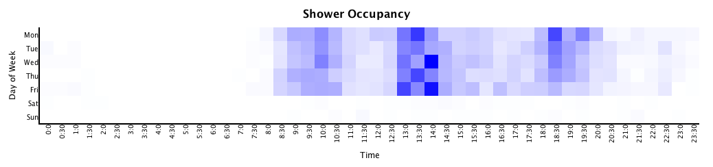

Are you interested in when you should go to the gym to get the best access to the machines and when the showers may (statistically) be free? 

Here is a heatmap that shows swipe-ins to the gym over the past year:

If we're assuming that people stay in the gym for an hour the gym occupancy looks something like this:

This is probably what you're interested in if you'd like to have a higher chance of being able to use the equipment.

Lastly, if you are mostly interested in using the showers, we can make a somewhat reasonable assumption that people work out for an hour and then
shower, in which case the shower occupancy heatmap would look like this:

If you want to play with the data, the [raw data is here](resources/gyminout.csv) and the
[sourcecode is available too](src/gymheatmap/core.clj).

Have fun and I hope it helps somebody :)
