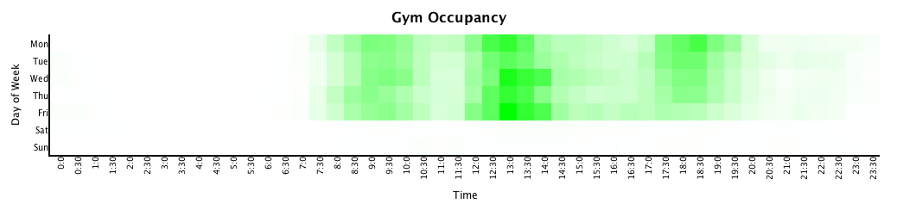

Interested in when you should go to the gym and when the showers may (statistically) be free? 
Here is a heatmap that shows swipe-ins to the gym over the past year:

If we're assuming that people stay in the gym for an hour (this may be relevant if you want to use the showers) the gym occupancy looks something like this:

If you want to play with the data, the [raw data is here](resources/gyminout.csv) and the
[sourcecode is available too](src/gymheatmap/core.clj).

Have fun and I hope it helps somebody :)
